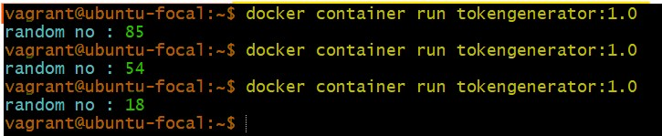

# tokengenerator-app
**Aim:** To Randomly generate the token  
**Purpose:** To bulid the docker image and run in the container environment  
**Tools/Tech Used:** Java | Docker | Maven | Git | Visual Studio Code 
**Steps to run the docker container**  
**Step1** Build the project using maven: mvn clean verify  
**Step2** Build the Docker image using docker directive  
**Step3** Run the Docker Container  
**Output:**

